# The Robotic Craftsman

<p>
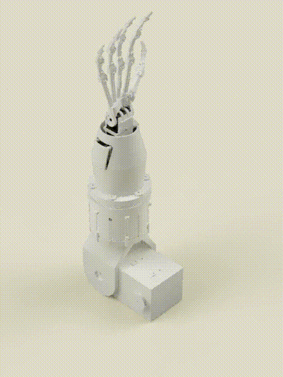
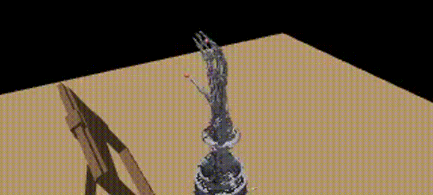
</p>

A robotic arm and two-finger hand built to reproduce hand-sewing on flimsy fabric. I filmed my own hand-sewing demonstrations, extracted 3D hand pose with WiLoR, and retargeted it onto my robot's embodiment in MuJoCo, then onto the real arm. Arm, hand, electronics and code are my own design.

Project page: https://kat2137.github.io/dlugosz-site/

- **Own data:** all footage was collected by me. I filmed myself and other sewers on a Canon camera on a small tripod (fixed viewpoint, right hand sewing through fabric). Sample: `assets/media/handsewing-footage.mp4`.
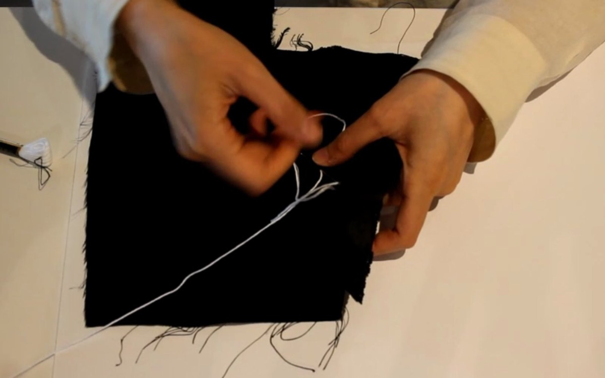
<sub>Capture setup: Canon camera on a tripod, fixed viewpoint.</sub>

- **Challenging embodiment:** human hand → servo arm with a two-finger tendon-driven hand. Task: needle manipulation in deformable fabric.

  <p>
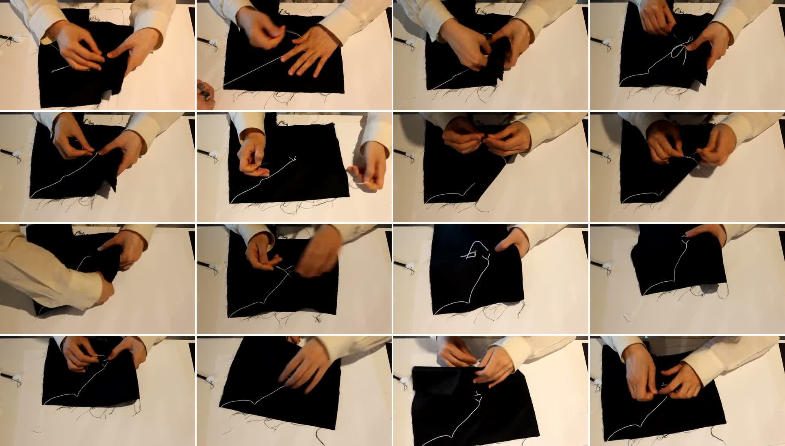
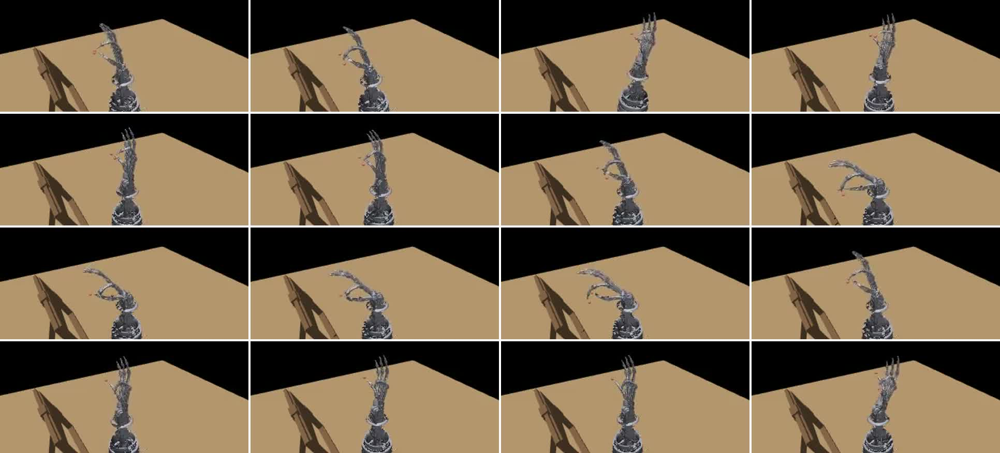
</p>
<sub>Left: own footage, one frame every 5 s. Right: the same sequence retargeted in MuJoCo.</sub>

- **Sim:** retargeted trajectories replayed in MuJoCo on the robot's own MJCF model (`model/palm.xml`, meshes exported from my Fusion 360 CAD).

## Pipeline
footage → WiLoR (21 keypoints/frame + camera translation) → hand-size scaling → vector-based retargeting (scipy optimiser) for fingers + hybrid elbow/wrist → MuJoCo replay → real arm (ST3215 servos, Jetson Orin Nano)
<p>
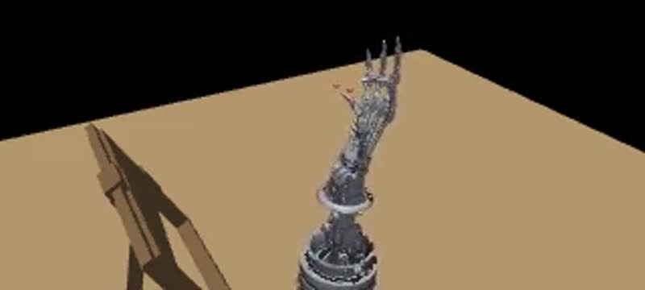
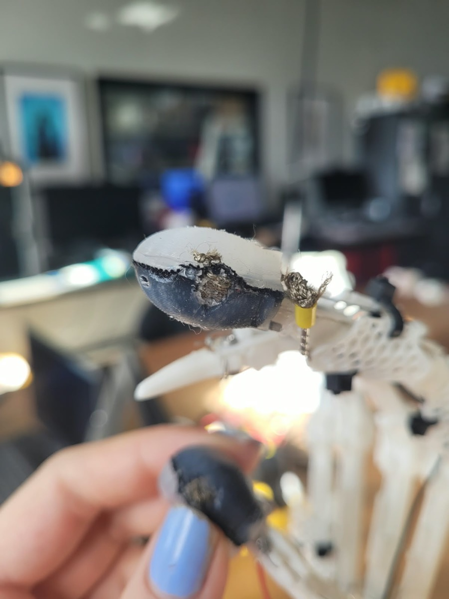
</p>
<sub>Own footage → retargeted in MuJoCo → real hand</sub>

- **Fingers:** joint angles are optimised so the robot's key vectors (wrist→fingertips, thumb↔index) match the scaled human ones.
- **Elbow:** follows the wrist's travel from WiLoR camera translation.
- **Wrist roll/tilt:** taken from palm orientation, not full position IK (more stable on noisy WiLoR wrist estimates).
- **Kinematics:** forward kinematics built from the CAD with Rodrigues' rotation formula; IK for the serial arm (law of cosines). Based on Jazar, *Theory of Applied Robotics*.
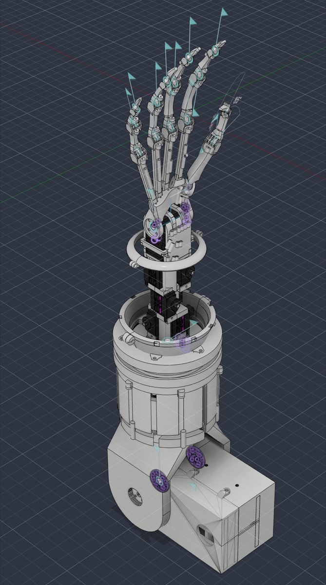

## Results
<p> </p>

- Fingertip retargeting error: mean <x> mm, median <y> mm (`assets/media/retarget_error.png`)
- Elbow angle, sim vs footage: <one line>

## Quickstart
```bash
python3 -m venv .venv && source .venv/bin/activate
pip install -r requirements.txt
python main_motion/<retarget_script>.py --input handsewing_01.npz      # solve robot angles
python main_motion/<replay_script>.py --angles <solved_angles>.npz     # render MuJoCo replay
```
WiLoR is not bundled (MANO licence). To process new footage, install WiLoR separately and run `visualize_pose_videos.py`, then `glob_json.py`.

## Design choices
- **Vector retargeting over per-joint angle mapping.** Copying human joint angles ignores the different link lengths of the robot hand. Matching key vectors (wrist→fingertips, thumb↔index) preserves the pinch, which is what holds the needle.
- **Hybrid elbow/wrist over full IK.** WiLoR's wrist position is relative to the fingers and noisy, so full position IK jittered. The elbow follows the wrist's travel from camera translation; wrist roll/tilt come from palm orientation.
- **Two fingers, not five.** The needle grip is a thumb–index pinch. Narrowing the scope made the real hardware reliable.
- **Pinch switch for needle detection.** A conductive-thread pad is stitched through each silicone fingertip cap, with the index and thumb pads facing each other. Each pad is wired to the Jetson. Holding the needle between them bridges the pads.

  <p>
  
  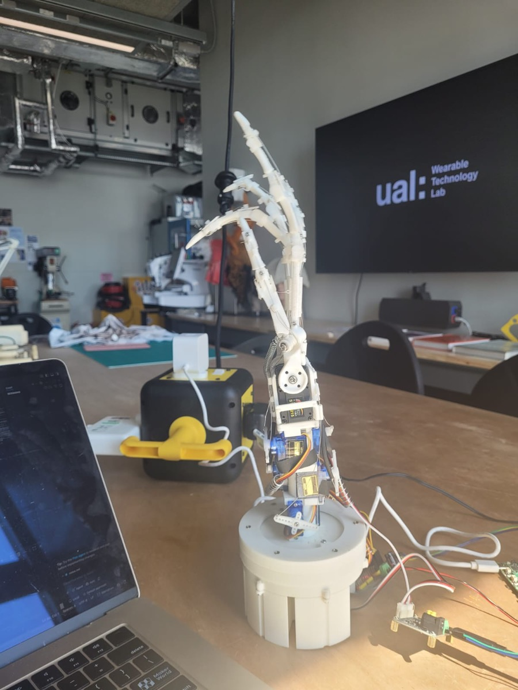
  </p>

- **One tendon per finger, spring return.** Each finger is flexed by a single Dyneema tendon routed through printed guides. Extension springs pull it back open, so each finger needs one actuator rather than an antagonistic tendon pair.

  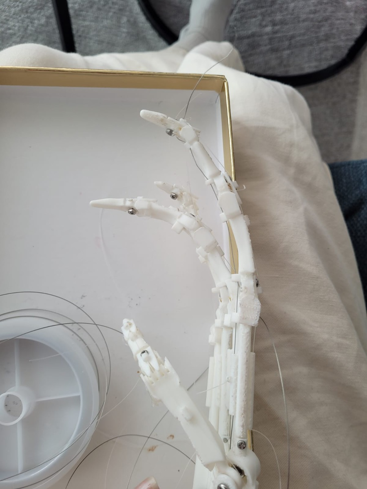

## What didn't work
- Per-joint angle mapping (see `notes.md`).
- IR sensing (ITR-9606) through silicone fingertips: signal too weak.
- Arm base lying on its side, as in the CAD: sagged under load, so it was rebuilt to stand on its face.
- Dyneema tendon creep: required re-tensioning and recalibration (`finger_calib.json`).

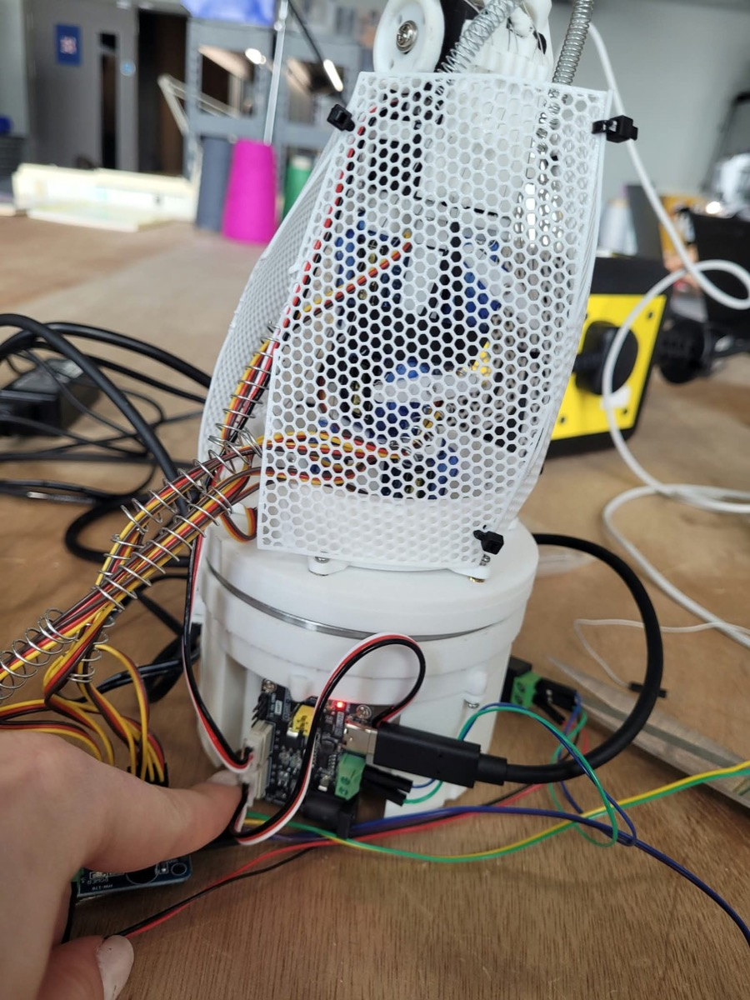

## Limitations and next steps
No learned policy yet: the robot replays retargeted demonstrations. Next steps:
1. Imitation learning on the hand-sewing demonstrations.
2. RL fine-tuning in sim.
3. Move to Isaac Lab for sim-to-real.

## Hardware
- Jetson Orin Nano
- ST3215 bus servos: wrist roll ID 1, wrist tilt ID 2, elbow ID 3
- Finger servos: <type>
- Silicone fingertip caps with conductive-thread pads
- 3D-printed arm (STLs in `model/meshes/`)

<p>
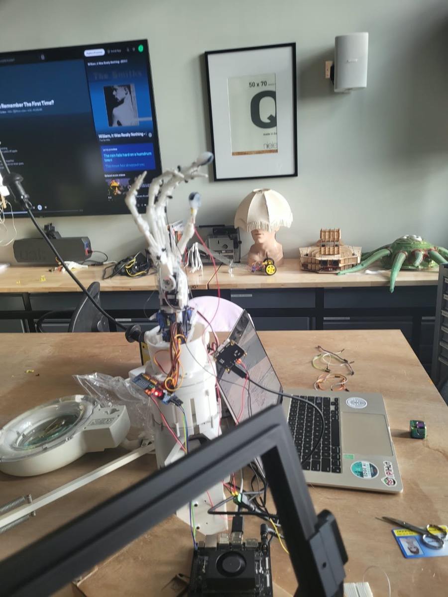
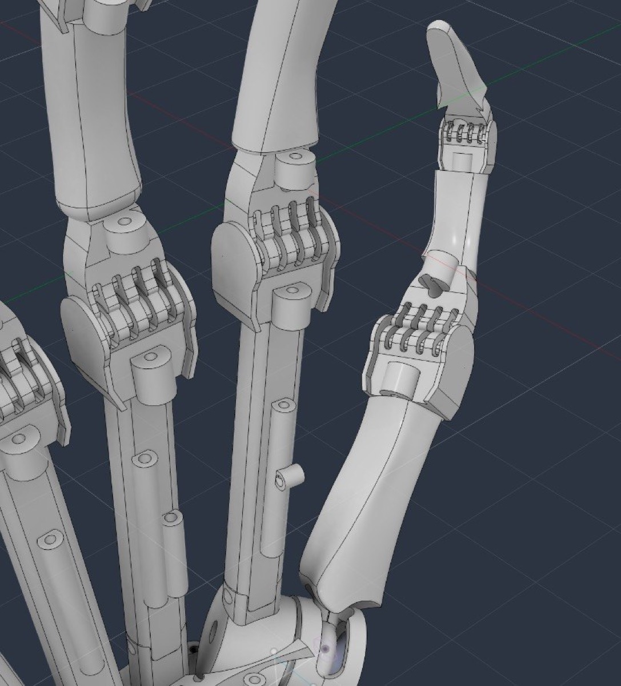
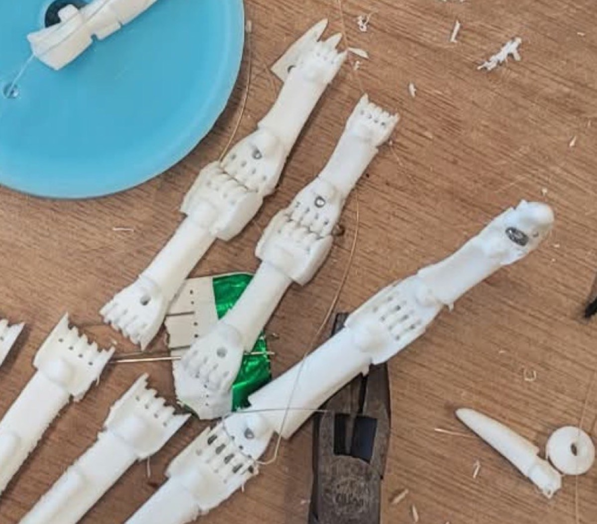
</p>

## Repo map
| Path | Contents |
|---|---|
| `main_motion/` | arm.py (servo/arm/finger classes + calibration), kinematics, retargeting |
| `model/` | MuJoCo MJCF + STL meshes |
| `cam/` | camera / needle-frame detection |
| `st_motors_setup/`, `servo_motors_setup/` | servo bring-up |
| `assets/media/` | videos, GIFs, plots |
| `notes.md` | development log |
| `retired/` | superseded approaches |

## Credits
WiLoR (hand pose). Jazar, *Theory of Applied Robotics*. AI was used for explanations only and as a diagnostic tool (for problems with no solution on the horizon); all code was written by me (see notes.md).


