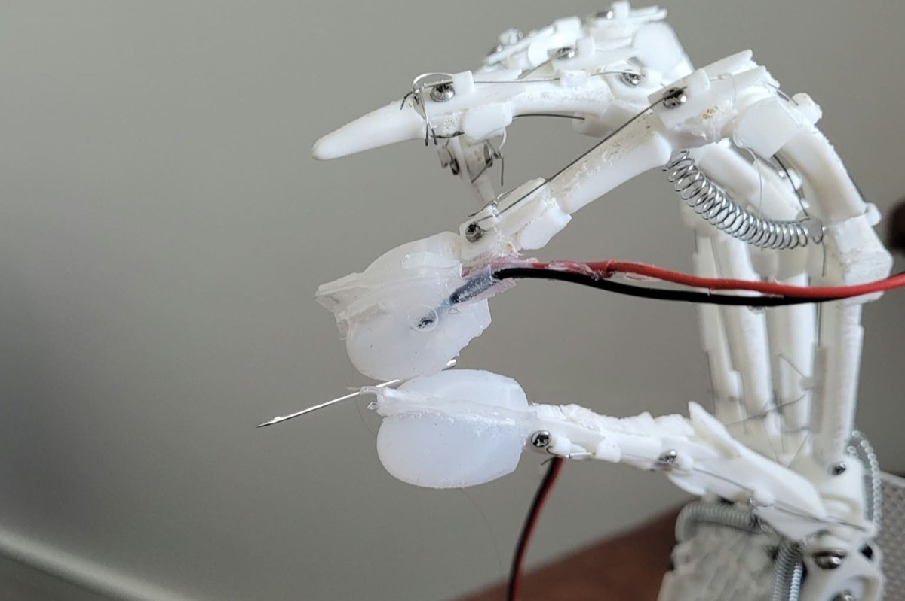
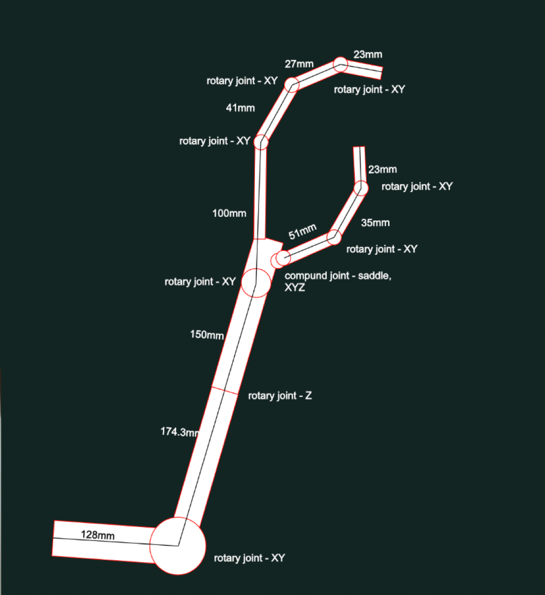
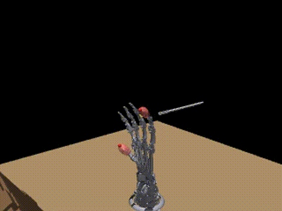
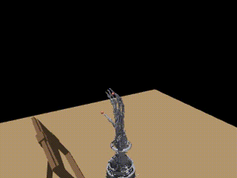
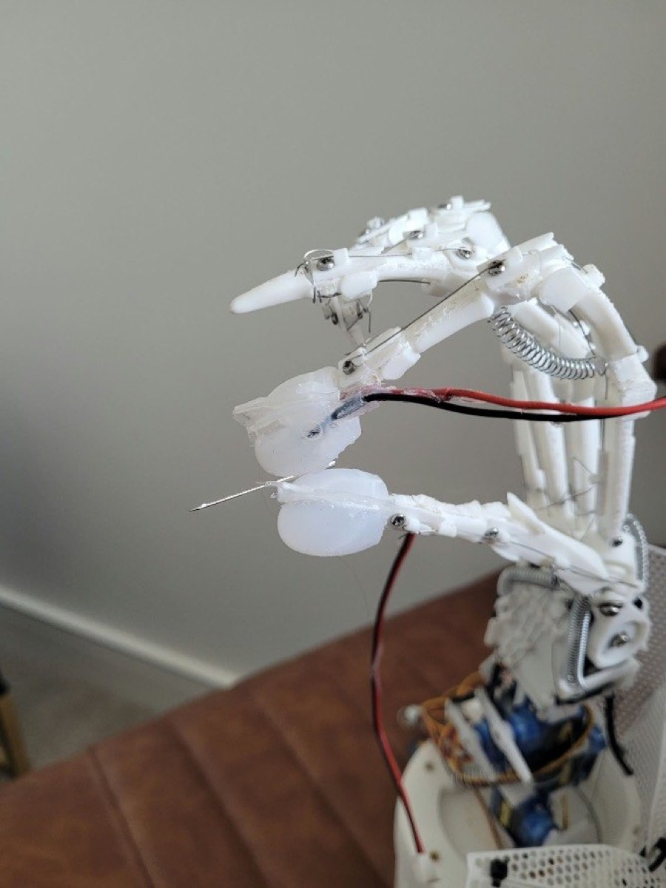
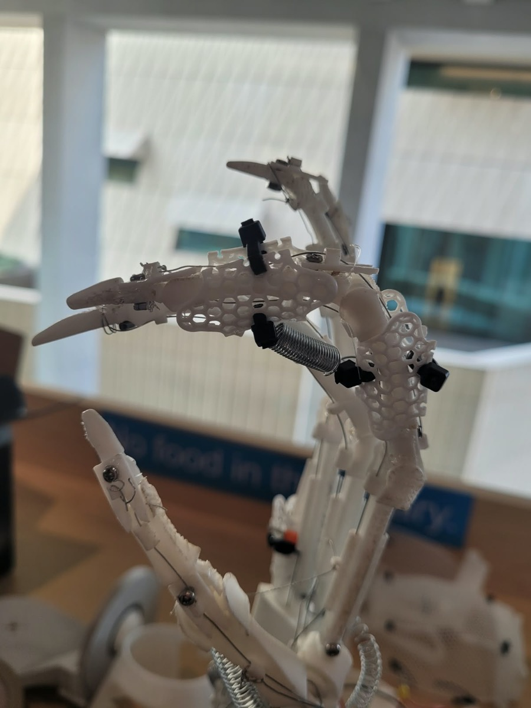

# The Robotic Craftsman (Hania)

<p>


</p>

A robotic arm and tendon-driven hand built to reproduce hand-sewing on flimsy fabric. I filmed hand-sewing demonstrations, extracted 3D hand pose with WiLoR, and retargeted it onto my robot in MuJoCo, then onto the real arm. Arm, hand, electronics and code are my own design.

Project page: https://kat2137.github.io/dlugosz-site/

## Challenge fit
- **Own data.** All footage was collected by me: I filmed myself and other sewers on a Canon camera on a small tripod (fixed viewpoint, right hand sewing through fabric). The sample clip used below is `handsewing_01`.
- **Challenging embodiment.** Human hand → 3-DoF servo arm with a five-finger, tendon-driven hand. Task: holding and pushing a needle through deformable fabric.
- **Sim.** Retargeted trajectories replayed in MuJoCo on the robot's own model (`model/palm_with_frame.xml`, meshes exported from my Fusion 360 CAD), including a free-floating needle held between the pads.

<p>


</p>
<sub>Left: own footage, one frame every 5 s. Right: the same clip retargeted in MuJoCo.</sub>

## Pipeline
footage → WiLoR (21 keypoints/frame + camera translation) → hand-size scaling → fingertip retargeting (scipy L-BFGS-B) + elbow/wrist from palm frame → MuJoCo replay → real arm

<p>



</p>
<sub>Own footage → retargeted in MuJoCo → real hand holding a needle</sub>

- **Scaling.** Human-to-robot finger scale is measured once from the clip (`retargeting/wlr_hand_to_robot.py` → `main_motion/scale_retarget.json`).
- **Fingers.** Per frame, thumb and index joint angles are optimised so the robot fingertips reach the scaled human fingertip targets, within joint limits (`retargeting/retargeting_sim.py`).
- **Elbow.** Follows the wrist's travel from WiLoR camera translation.
- **Wrist roll/tilt.** Taken from the palm frame (index MCP, pinky MCP, middle MCP, wrist), not full position IK, which was unstable on noisy WiLoR wrist estimates.
- **Kinematics.** Forward kinematics built from the CAD joint frames with Rodrigues' rotation formula (`main_motion/f_kinematics.py`); law-of-cosines IK for the serial arm (`main_motion/i_kinematics.py`). Based on Jazar, *Theory of Applied Robotics*.

<p>


</p>
<sub>Kinematic chain with link lengths and joint types · joint frames in CAD</sub>

## Results
<p>


</p>
<sub>Left: needle grip in sim (`grip_sim.py`). Right: retargeted sewing motion (`retargeting_sim.py`).</sub>

- Fingertip retargeting residual over N frames: mean X, median Y (`assets/media/retarget_cost.png`)
- Real arm: thumb–index pinch holds the needle and the pinch switch detects it.

## Quickstart
Run from the repo root (scripts import `arm.py` from there):
```bash
python3 -m venv .venv && source .venv/bin/activate
pip install -r requirements.txt
python -m main_motion.mjc_demo              # model sanity check → out.mp4
python -m retargeting.wlr_hand_to_robot     # hand-size scales → main_motion/scale_retarget.json
python -m retargeting.retargeting_sim       # solve + render → solved_angles_new.npz, real_sim6.mp4
python -m retargeting.grip_sim              # needle grip in sim → grasp_sim.mp4
```
`retargeting/retargeting.py` is the same pipeline driving the real servos (Jetson, Linux).

WiLoR is not bundled (MANO licence). To process new footage: install WiLoR, run `visualize_pose_videos.py`, then `glob_json.py` to build the `[frames, 21, 3]` keypoint array.

## Design choices
- **Fingertip targets over per-joint angle copying.** Copying human joint angles ignores the robot's different link lengths, so the pinch didn't close. Solving for fingertip positions preserves the pinch, which is what holds the needle.
- **Palm-frame wrist over full IK.** WiLoR's wrist position is estimated relative to the fingers and is noisy; full position IK jittered.
- **Five-finger hand, two-finger task.** The needle grip is a thumb–index pinch, so only thumb (flexion + adduction) and index are retargeted.
- **Pinch switch for needle detection.** A conductive-thread pad is stitched through each silicone fingertip cap, with the thumb and index pads facing each other and each wired to the Jetson. A held needle bridges the pads.
- **One tendon per finger, spring return.** Each finger is flexed by a single Dyneema tendon through printed guides; extension springs open it again, so each finger needs one actuator.

<p>



</p>
<sub>Conductive-thread pad in the silicone cap · needle held between the pads · spring return and tendon guides</sub>

## What didn't work
- **Per-joint angle mapping:** see above and `notes.md`.
- **IR sensing (ITR-9606) through the silicone caps:** signal too weak through the silicone (`itr_test.py`); replaced by the pinch switch.
- **Arm base lying on its side, as in the CAD:** sagged under load; the real base now stands on its face.
- **Dyneema creep:** tendons stretched over time, requiring re-tensioning and recalibration (`finger_calib.json`).

## Limitations and next steps
- No learned policy yet: the robot replays retargeted demonstrations.
- Next: imitation learning on the hand-sewing demonstrations, RL fine-tuning in sim, then Isaac Lab for sim-to-real.

## Hardware
- Jetson Orin Nano
- 3× ST3215 bus servos: wrist roll (ID 1), wrist tilt (ID 2), elbow (ID 3, 2:1 gearing)
- PWM finger servos on a PCA9685 driver, one tendon each
- Silicone fingertip caps with conductive-thread pads
- 3D-printed arm and hand (STLs in `model/meshes/`)

<p>


</p>
<sub>Assembled arm · electronics in the forearm · printed finger parts</sub>

## Repo map
| Path | Contents |
|---|---|
| `arm.py` | Core classes: ST and PWM servos, calibration, hand pose, MuJoCo wrapper, camera |
| `retargeting/` | Hand-size scaling, retargeting (sim and real), needle-grip sim |
| `main_motion/` | Forward/inverse kinematics, MuJoCo demo and joint map, grasp tests |
| `main_motion/calib/` | Joint limits, angle mapping, position logging against video |
| `model/` | MuJoCo MJCF and STL meshes |
| `cam/` | CSI camera setup, checkerboard calibration, object/needle estimation |
| `scservo_sdk/` | Vendored Feetech SDK for the ST3215 servos |
| `visualize_pose*.py`, `glob_json.py`, `angle_computation.py` | WiLoR processing and angle extraction |
| `finger_calib.json` | Finger calibration from grasp tests |
| `notes.md` | Development log |
| `retired/` | Superseded approaches, including early servo setup scripts |

## Credits
WiLoR (hand pose). Jazar, *Theory of Applied Robotics*. AI was used for explanations and as a diagnostic tool when I was stuck; all code was written by me (see `notes.md`).
